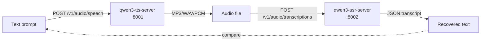

# qwen3-asr-server

OpenAI-compatible HTTP server for [**Qwen3-ASR-1.7B**](https://huggingface.co/Qwen/Qwen3-ASR-1.7B) (Whisper-style speech-to-text) with **vLLM acceleration**, **fp8 KV cache**, **context-primed transcription**, and clean text output (language prefix auto-stripped).

Built for low-latency conversational voice agents — runs comfortably alongside a TTS model on a single 16 GB GPU and supports **52 languages**.

> Companion project: [**qwen3-tts-server**](https://github.com/malaiwah/qwen3-tts-server) — the matching text-to-speech server. Together they form a complete voice loop.

---

## What you get

- 🎙️ `/v1/audio/transcriptions` — Whisper-compatible transcription (clean output, no `language X\n` prefix)
- 🔄 `/v1/audio/translations` — API-compatible shim (transcribes in detected language; see note below)
- 🧠 `/v1/chat/completions` — context-primed transcription via `input_audio` parts (vocabulary biasing)
- 🌍 **52 languages** — English, French, Chinese, Japanese, Korean, Spanish, German, Italian, Arabic, …
- ⚡ vLLM backend with **fp8 KV cache** + prefix caching → ~250 ms for 5 s clip
- 🧰 Drop-in Whisper replacement — same API, just change the base URL
- 🐳 Single-container deploy, Ubuntu 24.04
- 🐌 CPU fallback (`--cpu`) for smoke tests

---

## Architecture: proxy, not execv

Previous versions used `os.execv` to hand off to `qwen-asr-serve`, which prevented any response post-processing.  The server now starts vLLM as a subprocess on an internal port and proxies all requests through — enabling:

- **Language prefix stripping**: Qwen3-ASR internally prepends `language English\n` (or `language French\n`, …) to every response.  The server strips this before returning.
- **Proper `/health` endpoint** that reflects actual model readiness.
- **Clean `/v1/audio/translations` shim** for Whisper API compatibility.
- **Extra CLI flags forwarded to vLLM** (`--gpu-memory-utilization`, `--kv-cache-dtype`, etc.)

---

## Host prerequisites (GPU)

Before running the container, install the NVIDIA driver and container toolkit on the host.

```bash
# --- NVIDIA driver (Ubuntu 24.04, from the official CUDA repo) ---
# Open kernel module — recommended for Turing, Ampere, Ada Lovelace, Blackwell
curl -fsSL https://developer.download.nvidia.com/compute/cuda/repos/ubuntu2404/x86_64/3bf863cc.pub \
  | sudo gpg --dearmor -o /etc/apt/keyrings/nvidia-cuda.gpg
printf 'Types: deb\nURIs: https://developer.download.nvidia.com/compute/cuda/repos/ubuntu2404/x86_64/\nSuites: /\nSigned-By: /etc/apt/keyrings/nvidia-cuda.gpg\n' \
  | sudo tee /etc/apt/sources.list.d/nvidia-cuda.sources
sudo apt-get update
sudo apt-get install -y nvidia-driver-open nvidia-container-toolkit

# For Docker — configure runtime and restart
sudo nvidia-ctk runtime configure --runtime=docker
sudo systemctl restart docker

# For Podman — generate CDI specs (enables --device nvidia.com/gpu=all)
sudo nvidia-ctk cdi generate --output=/etc/cdi/nvidia.yaml

# Verify
nvidia-smi
```

> **Driver note**: `nvidia-driver-open` uses the open kernel module and works on Turing+.
> For Pascal and older GPUs use the proprietary variant (`nvidia-driver-XXX`).

---

## Quickstart (Docker / Podman)

```bash
# 1. Run the container
docker run -d --name qwen3-asr \
  --gpus all \
  -p 8002:8000 \
  -v qwen3-hf-cache:/root/.cache/huggingface \
  ghcr.io/malaiwah/qwen3-asr-server:latest \
  --host 0.0.0.0 --port 8000 \
  --gpu-memory-utilization 0.65 \
  --max-model-len 4096 \
  --max-num-seqs 4 \
  --kv-cache-dtype fp8

# Podman equivalent (requires CDI — see Host prerequisites above):
# podman run -d --name qwen3-asr \
#   --device nvidia.com/gpu=all \
#   ...

# 2. Watch startup
docker logs -f qwen3-asr   # look for "✓ vLLM backend ready"

# 3. Transcribe
curl -X POST http://localhost:8002/v1/audio/transcriptions \
  -F model=Qwen/Qwen3-ASR-1.7B \
  -F file=@my-recording.wav
# → {"text": "Hello from Qwen3."}
```

> **Sharing a GPU with TTS?**  
> Start TTS first (fixed ~4.4 GB footprint), then ASR with `--gpu-memory-utilization 0.55`.  
> vLLM auto-sizes its KV cache to whatever VRAM is left.  
> See `docker-compose.yml` for the full orchestrated setup.

---

## Quickstart (uv, no container)

```bash
git clone https://github.com/malaiwah/qwen3-asr-server.git
cd qwen3-asr-server
uv venv && source .venv/bin/activate

# GPU (vLLM-backed, production):
uv pip install -e ".[gpu]"
python server.py --host 0.0.0.0 --port 8002 \
  --gpu-memory-utilization 0.65 \
  --max-model-len 4096 \
  --kv-cache-dtype fp8

# CPU fallback (transformers, slow):
uv pip install -e ".[cpu]"
python server.py --cpu --port 8002

# In another shell:
./test-asr.py my-recording.wav
./test-asr.py my-recording.wav --language English
./test-asr.py my-recording.wav --context "Hermes Agent, Honcho memory, oikos"
```

> **Note on GPU install**: vLLM may require `nvcc` (CUDA toolkit) to install.  
> On Ubuntu: `sudo apt-get install -y nvidia-cuda-toolkit` before `uv pip install -e ".[gpu]"`.

---

## OpenAI / Whisper SDK drop-in

```python
from openai import OpenAI

client = OpenAI(
    api_key="not-needed",
    base_url="http://localhost:8002/v1",
)

with open("audio.wav", "rb") as f:
    transcript = client.audio.transcriptions.create(
        model="Qwen/Qwen3-ASR-1.7B",
        file=f,
    )
print(transcript.text)  # Clean output — no "language English\n" prefix
```

---

## Round-trip with qwen3-tts-server



```bash
# 1. Synthesise (qwen3-tts-server)
./test-tts.py "The quick brown fox jumps over the lazy dog." -o sample.wav --format wav

# 2. Transcribe
./test-asr.py sample.wav
# → "The quick brown fox jumps over the lazy dog."
```

To run both services with a single command:
```bash
HF_TOKEN=hf_xxx docker compose up -d
```
See [`docker-compose.yml`](docker-compose.yml) for VRAM budget, startup ordering, and health checks.

---

## Hardware reference (tested)

### Primary (benchmarks below)

| Component | Spec |
|---|---|
| **GPU** | NVIDIA GeForce RTX 4080 SUPER (16 GB VRAM, Ada Lovelace) |
| **CPU** | Intel Core i7-14700 KF (20 cores / 28 threads) |
| **RAM** | 32 GB DDR5 |
| **OS** | Ubuntu 24.04.4 LTS |
| **Driver** | NVIDIA 595.58.03 (CUDA 13.x) |

### Also validated on

| GPU | VRAM | Notes |
|-----|------|-------|
| NVIDIA GRID A100D-20C (Vultr vGPU) | 20 GB | Use `--gpu-memory-utilization 0.55` when co-located with TTS |

### VRAM budget (16 GB, TTS + ASR on same GPU)

```
RTX 4080 SUPER:                       16,376 MiB
  TTS (bfloat16 + CUDA graphs):        4,400 MiB  (qwen3-tts-server)
  ASR (fp8 KV + vLLM):                10,400 MiB  (this server, --gpu-mem-util 0.55)
    - Model weights:                   3,870 MiB
    - KV cache (fp8):                  5,130 MiB
    - CUDA graphs + overhead:          1,400 MiB
  Total:                              ~14,800 MiB / ~90%
```

**Start order matters**: TTS first (fixed footprint), then ASR — vLLM auto-sizes KV cache.

### Performance (RTX 4080 SUPER, vLLM + fp8)

| Workload | Wall time |
|---|---|
| 5 s mono WAV | ~250 ms |
| 30 s mono WAV | ~600 ms |
| Context-primed (`/v1/chat/completions`) | ~+50 ms overhead |

### Performance (GRID A100D-20C vGPU)

| Workload | Wall time |
|---|---|
| 5 s mono WAV | ~400 ms |
| 30 s mono WAV | ~900 ms |

The vGPU adds hypervisor overhead; absolute latency is higher but RTF is still excellent.

---

## API reference

### `POST /v1/audio/transcriptions` — Whisper-compatible

```bash
curl -X POST http://localhost:8002/v1/audio/transcriptions \
  -F model=Qwen/Qwen3-ASR-1.7B \
  -F file=@audio.wav \
  -F language=en          # optional ISO-639-1 hint
  -F response_format=json # json | text | verbose_json | srt | vtt
```

Response:
```json
{ "text": "Hello from Qwen3." }
```

The `language X\n` prefix that Qwen3-ASR internally prepends is always stripped.

### `POST /v1/audio/translations` — API compatibility shim

Same interface as `/v1/audio/transcriptions`.  **Note**: Qwen3-ASR does not translate to English — it transcribes in the detected language.  The response includes a `_note` field explaining this.  For actual translation, pass the transcript to a downstream LLM.

### `POST /v1/chat/completions` — context-primed transcription

Bias vocabulary, language, or named entities with a system prompt:

```json
{
  "model": "Qwen/Qwen3-ASR-1.7B",
  "messages": [
    {"role": "system", "content": "Speaker uses English/French. May say: Hermes, Honcho, oikos, malaiwah."},
    {"role": "user", "content": [
      {"type": "input_audio", "input_audio": {"data": "<base64>", "format": "wav"}}
    ]}
  ],
  "temperature": 0.0
}
```

Returns standard chat completion JSON.  Requires GPU / vLLM backend.

### `GET /health`, `GET /v1/models`

Standard introspection.  `/health` reflects actual vLLM readiness.

---

## Configuration

| Env var | Default | Purpose |
|---|---|---|
| `QWEN3_ASR_MODEL_ID` | `Qwen/Qwen3-ASR-1.7B` | Override the HF model |
| `HF_HOME` | `/root/.cache/huggingface` | Weight cache. **Mount a volume here.** |
| `HF_TOKEN` | *(unset)* | HuggingFace token for gated downloads |

CLI flags (forwarded to vLLM in GPU mode):

| Flag | Default | Purpose |
|---|---|---|
| `--host` / `--port` | `0.0.0.0` / `8000` | Listener |
| `--gpu-memory-utilization` | `0.9` | **Lower to 0.55** when sharing GPU with TTS |
| `--max-model-len` | `4096` | Context window |
| `--kv-cache-dtype` | *(vLLM default)* | `fp8` recommended — halves KV VRAM |
| `--max-num-seqs` | *(vLLM default)* | Concurrent requests |
| `--cpu` | *(off)* | Force transformers fallback (very slow) |

---

## Building from source

```bash
docker build -t qwen3-asr-server:latest -f Containerfile .
```

CI builds and pushes to `ghcr.io/malaiwah/qwen3-asr-server:latest` on every push to `main`.

---

## Tests

```bash
uv pip install -e ".[test]"
pytest -q
```

Smoke tests run without a GPU or model load.

---

## CPU mode

CPU inference is **orders of magnitude slower** (multi-second per short clip).
Use only for smoke tests, API surface exploration, or environments without a GPU.

For production use, a CUDA GPU with ≥ 6 GB VRAM is required.

---

## Acknowledgements

- [Qwen team @ Alibaba](https://huggingface.co/Qwen) for [Qwen3-ASR-1.7B](https://huggingface.co/Qwen/Qwen3-ASR-1.7B)
- [vLLM](https://github.com/vllm-project/vllm) for the inference engine
- [`qwen-asr`](https://pypi.org/project/qwen-asr/) for the upstream serving CLI

---

## License

[MIT](LICENSE)
