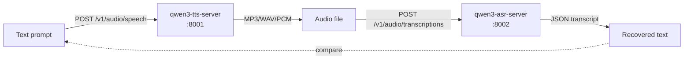

# qwen3-asr-server

OpenAI-compatible HTTP server for [**Qwen3-ASR-1.7B**](https://huggingface.co/Qwen/Qwen3-ASR-1.7B) (Whisper-style speech-to-text) with **vLLM acceleration**, **fp8 KV cache**, and **context-primed transcription** for vocabulary biasing.

Built for low-latency conversational voice agents — runs comfortably alongside a TTS model on a single 16 GB GPU and supports **52 languages**.

> Companion project: [**qwen3-tts-server**](https://github.com/malaiwah/qwen3-tts-server) — the matching text-to-speech server. Together they form a complete voice loop: text → TTS → audio → ASR → text.

---

## What you get

- 🎙️ `/v1/audio/transcriptions` — Whisper-compatible single-shot transcription
- 🧠 `/v1/chat/completions` — context-primed transcription via `input_audio` content parts (system prompt steers vocabulary, languages, named entities)
- 🌍 **52 languages** — including English, French, Chinese, Japanese, Korean, Spanish, German, Italian, Portuguese, Arabic, …
- ⚡ vLLM backend with **fp8 KV cache** + prefix caching → low latency, high throughput
- 🧰 OpenAI-compatible — drop into Whisper clients with just a base URL change
- 🐳 Single-container deploy with HuggingFace cache volume
- 🐌 CPU fallback (`--cpu`) for smoke tests / no-GPU environments

---

## Quickstart (Docker / Podman)

```bash
# 1. Run the container — mount a volume for the HF model cache (~4 GB once cached)
podman run -d --name qwen3-asr \
  --device nvidia.com/gpu=all \
  -p 8002:8000 \
  -v qwen3-hf-cache:/root/.cache/huggingface \
  ghcr.io/malaiwah/qwen3-asr-server:latest \
  --host 0.0.0.0 --port 8000 \
  --gpu-memory-utilization 0.65 \
  --max-model-len 4096 \
  --max-num-seqs 4 \
  --kv-cache-dtype fp8

# (Optional) supply a HuggingFace token if you've gated your downloads
#   -e HF_TOKEN=hf_xxx

# 2. Watch it warm up
podman logs -f qwen3-asr   # look for "Application startup complete"

# 3. Try it
curl -X POST http://localhost:8002/v1/audio/transcriptions \
  -F model=Qwen/Qwen3-ASR-1.7B \
  -F file=@my-recording.wav
# → {"text": "Hello from Qwen3."}
```

> **Sharing a 16 GB GPU with TTS?** Tune `--gpu-memory-utilization 0.55` and start the TTS container first (it has a fixed footprint) so vLLM can size its KV cache to whatever's left.

---

## Quickstart (uv, no container)

```bash
git clone https://github.com/malaiwah/qwen3-asr-server.git
cd qwen3-asr-server
uv venv && source .venv/bin/activate

# GPU (production) — vLLM-backed:
uv pip install -e ".[gpu,test]"
qwen-asr-serve Qwen/Qwen3-ASR-1.7B --host 0.0.0.0 --port 8002 --kv-cache-dtype fp8

# CPU fallback (slow, for smoke tests only):
uv pip install -e ".[cpu,test]"
python server.py --cpu --port 8002

# In another shell:
./test-asr.py my-recording.wav
./test-asr.py my-recording.wav --language English
./test-asr.py my-recording.wav --context "Hermes Agent, Honcho memory, oikos host"
```

---

## Round-trip with qwen3-tts-server

The two servers compose naturally — generate speech with one, transcribe it back with the other:



```bash
# 1. Synthesise (qwen3-tts-server)
./test-tts.py "The quick brown fox jumps over the lazy dog." -o sample.wav --format wav

# 2. Transcribe
./test-asr.py sample.wav
# → "The quick brown fox jumps over the lazy dog."
```

---

## Hardware reference (tested)

The numbers below come from a single GPU host nicknamed **Creativity**, running both this server **and** [qwen3-tts-server](https://github.com/malaiwah/qwen3-tts-server) on the same card:

| Component | Spec |
|---|---|
| **GPU** | NVIDIA GeForce RTX 4080 SUPER (16 GB VRAM, Ada Lovelace) |
| **CPU** | Intel Core i7-14700 KF (20 cores / 28 threads) |
| **RAM** | 32 GB DDR5 |
| **OS** | Ubuntu 24.04.4 LTS |
| **Driver** | NVIDIA 595.58.03 (CUDA 13.x) |

### VRAM budget (when sharing with TTS)

```
RTX 4080 SUPER:                       16,376 MiB
  TTS model (bfloat16 + flash-attn):   4,400 MiB  (qwen3-tts-server)
  ASR model + fp8 KV + cudagraphs:    10,400 MiB  (this server)
    - Model weights:                   3,870 MiB
    - KV cache (fp8, 95,968 tokens):   5,130 MiB
    - CUDA graphs + overhead:          1,400 MiB
  Total utilisation:                   ~90%
```

**Order matters**: start TTS first (fixed footprint), then ASR — vLLM
auto-sizes its KV cache to whatever VRAM remains.

### Performance (RTF)

| Workload | Wall time |
|---|---|
| Short clip (5 s mono WAV) | ~250 ms |
| Long clip (30 s mono WAV) | ~600 ms |
| Context-primed (`/v1/chat/completions`) | ~+50 ms vs plain transcription |

Throughput scales with `--max-num-seqs`; defaults are tuned for 1–4 concurrent requests.

---

## API reference

### `POST /v1/audio/transcriptions` — Whisper-compatible

```bash
curl -X POST http://localhost:8002/v1/audio/transcriptions \
  -F model=Qwen/Qwen3-ASR-1.7B \
  -F file=@audio.wav \
  -F language=en       # optional ISO-639-1 hint
```

Response:
```json
{ "text": "Hello from Qwen3." }
```

### `POST /v1/chat/completions` — context-primed (vocabulary biasing)

Bias the recognition with a system prompt — useful for domain-specific
terms, named entities, code identifiers, or multilingual speakers:

```bash
curl -X POST http://localhost:8002/v1/chat/completions \
  -H "Content-Type: application/json" \
  -d '{
    "model": "Qwen/Qwen3-ASR-1.7B",
    "messages": [
      {"role": "system", "content": "The speaker uses English and French. They may say: Hermes Agent, Honcho, oikos, malaiwah."},
      {"role": "user", "content": [
        {"type": "input_audio", "input_audio": {"data": "<base64 audio>", "format": "wav"}}
      ]},
    ],
    "temperature": 0.0
  }'
```

Returns a standard chat completion with the transcription in `choices[0].message.content`. The JSON response also includes the detected language in the response payload (when supported by the model).

### `GET /v1/models`, `GET /health`

Standard introspection.

---

## Configuration

| Env var | Default | Purpose |
|---|---|---|
| `QWEN3_ASR_MODEL_ID` | `Qwen/Qwen3-ASR-1.7B` | Override the HF model |
| `HF_HOME` | `/root/.cache/huggingface` | Where weights are cached. **Mount a volume here.** |
| `HF_TOKEN` | *(unset)* | Optional — only needed if you've gated downloads on your account |

CLI flags (default GPU/vLLM entrypoint — these forward to `qwen-asr-serve`):

| Flag | Default | Purpose |
|---|---|---|
| `--host` / `--port` | `0.0.0.0` / `8000` | Listener |
| `--gpu-memory-utilization` | `0.9` | Lower this when sharing the GPU |
| `--max-model-len` | `4096` | Context window |
| `--max-num-seqs` | (vLLM default) | Concurrent requests during cudagraph capture |
| `--kv-cache-dtype` | `fp8` | KV cache dtype — fp8 saves ~2× VRAM |

When invoking `python server.py --cpu` instead, the script runs a
transformers-based fallback that exposes a minimal subset of the API
(`/v1/audio/transcriptions` + `/health` + `/v1/models`).

---

## Building from source

```bash
podman build -t qwen3-asr-server:latest -f Containerfile .
```

The CI workflow in `.github/workflows/build.yml` builds and pushes
to `ghcr.io/<owner>/qwen3-asr-server:latest` on every push to `main`
plus version tags.

---

## Tests

Smoke tests don't require a GPU or a model load:

```bash
uv pip install -e ".[test]"
pytest -q
```

---

## CPU mode warning

The CPU fallback uses plain `transformers` (no vLLM) and is **orders of
magnitude slower** than the GPU path. Use it only for:

- environments without an NVIDIA GPU
- smoke tests / CI
- demonstrating the API surface

For real conversational use, a CUDA GPU with ≥ 6 GB VRAM is strongly recommended.

---

## Acknowledgements

- [Qwen team @ Alibaba](https://huggingface.co/Qwen) for the [Qwen3-ASR-1.7B](https://huggingface.co/Qwen/Qwen3-ASR-1.7B) model
- [vLLM](https://github.com/vllm-project/vllm) for the inference engine
- [`qwen-asr`](https://pypi.org/project/qwen-asr/) for the upstream serving CLI

---

## License

[MIT](LICENSE) — free for any use; please credit the upstream Qwen model card and follow its license terms separately.
